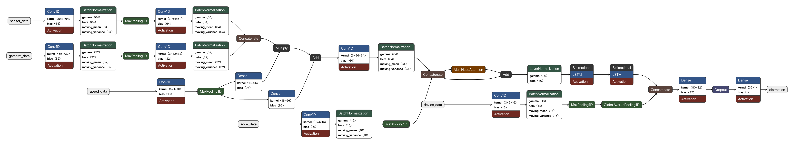
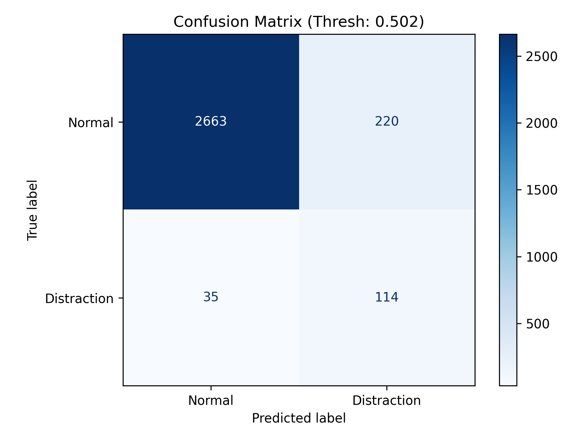
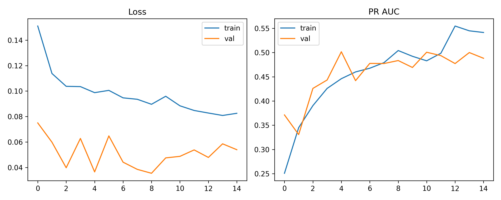

# On-Device Driver Distraction Detection (Edge AI)

Real-time detection of driver–smartphone interaction, running **entirely on the phone** — no cloud, no continuous data upload, no connectivity dependence.

Developed during a curricular internship at **[Sentilant](https://sentilant.com)** (Telematics-as-a-Service) in partnership with **ISEC – Instituto Superior de Engenharia de Coimbra**, Feb–Jul 2026. The model was integrated into a functional proof-of-concept inside Sentilant's production telemetry SDK.

> **TL;DR** — A hybrid CNN + BiLSTM model with FiLM speed conditioning, quantized to **0.68 MB TensorFlow Lite**, that flags driver distraction from raw IMU + GNSS streams. In on-road field tests (including unseen highway driving) **88.4% of the episodes it flagged were genuine distractions**, with no false positives on out-of-distribution data.



---

## The problem

Distracted driving is a leading road-safety risk, and smartphone use is one of its main causes. Existing mobile-telematics solutions process driving data in the cloud, which adds latency, depends on network coverage, and raises privacy concerns (GDPR) from continuously streaming telemetry off-device.

This project takes the opposite approach: **Edge AI**. The model runs locally on the driver's phone, so distraction is detected with minimal latency, no telemetry leaves the device, and the system keeps working in areas with poor connectivity.

## What it detects

Manual interaction with the phone while driving (handling/operating the device), inferred purely from telemetry the phone already collects:

- **Inertial sensors** — gyroscope, linear accelerometer, gravity, game-rotation vector
- **GNSS** — speed
- **Device state** — screen-lock and hands-free audio routing

---

## The model — `v14.5` ("spectral-texture")

A hybrid deep-learning architecture trained on **10-second windows** of multi-stream sensor data sampled at **16.67 Hz**.

```
   sensor streams ─► Conv1D encoders ─┐
                                      ├─► FiLM conditioning (speed) ─► Conv1D refine
   GNSS speed ──────────────────────┘            │
                                                 ▼
                                   MultiHeadAttention ─► BiLSTM stack
                                                 │
   device state ─► GlobalAvgPool ──── late fusion ┘
                                                 ▼
                                       Dense head ─► sigmoid (distraction)
```

1. **Per-stream Conv1D encoders** learn local motion morphology independently for each sensor stream.
2. **FiLM (Feature-wise Linear Modulation)** lets vehicle speed modulate the sensor representation, so the same hand motion is interpreted differently at a stop vs. at speed.
3. **Temporal refinement** — Conv1D → Multi-Head Attention → Bidirectional LSTM captures the temporal signature of a distraction gesture.
4. **Late fusion** folds in discrete device state (locked / hands-free).
5. **Dynamic-range quantization** to TensorFlow Lite for on-device inference.

The architecture lives in [`src/build_model.py`](src/build_model.py); the per-version feature/stream definitions in [`src/feature_config.py`](src/feature_config.py). The model also runs **live on a phone** — see [`android-demo/`](android-demo/), a standalone Android app that collects sensor streams and runs this exact TFLite model in real time.

### The interesting part: spectral-texture features

`v14.5` adds four dense, magnitude-orthogonal **spectral-texture channels** (high-frequency power ratio and zero-crossing rate of the *raw* gyro/accel signal). These encode a causal physical mechanism:

> A phone **rigidly mounted** in the car transmits road vibration → high-frequency energy. A phone **held in the hand** damps it → low-frequency energy.

This feature set had the **worst** offline PR-AUC of all candidates — yet was the **best** performer in real-world field testing. The offline random-split metric rewards trip-specific shortcuts; the spectral mechanism is device-agnostic and *transfers* to conditions never seen in training (e.g. highway). It trades in-distribution separability for **out-of-distribution robustness** — exactly the right bias for a safety alert, where false positives cause alert fatigue.

This is the headline engineering lesson of the project: **field behavior, not offline metrics, is ground truth.**

---

## Results

| | Test set (held-out trips) | Field evaluation (6 real trips, incl. highway) |
|---|---|---|
| Distraction events caught | 114 / 149 (**76% recall**) | 38 / 50 episodes |
| Precision of flagged events | — | **88.4%** |
| False positives on OOD highway | — | **0** |

Offline metrics: **ROC-AUC 0.95**, PR-AUC 0.45, F1 0.47 at the deployed operating threshold (tuned conservative / high-precision).

**Footprint:** Keras 1.98 MB → **TFLite 0.68 MB** after quantization; sub-second batch inference.

<p align="center">
  
  
</p>

---

## Repository layout

```
.
├── README.md
├── LICENSE                       # CC BY-ND 4.0
├── inference_example.py          # load the TFLite model and run it (name-based I/O)
├── model/
│   ├── model.tflite              # deployed quantized model (0.68 MB)
│   ├── keras_model.keras         # full-precision Keras model
│   ├── metadata.json             # input names, feature lists, threshold, window size
│   └── results.json              # metrics + CVPFI feature-importance
├── src/
│   ├── feature_config.py         # stream/feature definitions per model version
│   └── build_model.py            # the Keras functional architecture
├── android-demo/                 # standalone Android app: runs the model on-device, live
└── figures/                      # architecture, confusion matrix, training curves, field timelines
```

## Running inference

```bash
python inference_example.py
```

[`inference_example.py`](inference_example.py) loads the full-precision Keras model and runs one window. Inputs are matched **by tensor name** (`sensor_data`, `speed_data`, `device_data`), never by positional index, since conversion can reorder tensors:

```
window = 10 s  |  threshold = 0.502
  sensor_data  shape=(1, 166, 11)  ...
  speed_data   shape=(1, 166, 1)   ...
  device_data  shape=(1, 166, 2)   ...
  P(distraction) = 0.709 -> DISTRACTED
```

The shipped `model.tflite` is the quantized on-device artifact. Because the architecture contains an LSTM, its TFLite graph uses TensorFlow *Flex* ops, so it runs through the LiteRT / Flex delegate (on Android, the `tensorflow-lite-select-tf-ops` dependency). The on-device, name-matched TFLite call is documented at the bottom of `inference_example.py`.

---

## Tech stack

`Python 3.12` · `TensorFlow / Keras` · `TensorFlow Lite` · `NumPy / pandas` · `scikit-learn` · `Android SDK` (deployment target)

## Key engineering decisions

- **Trip-based train/test split** (never window-level) — windows from the same trip in both splits cause severe leakage through stride overlap.
- **Conservative high-precision threshold** — for a distraction *alert*, a false positive (alert fatigue) is costlier than a missed event.
- **Feature importance via CVPFI** (cross-validation permutation importance) — confirmed the sensor stream carries the signal and device state contributes near-zero, guiding feature pruning.
- **Frozen model registry** — deployed artifacts are made read-only with provenance metadata so a sweep can never overwrite a field-validated model again.

---

## License & data

This repository is licensed under **Creative Commons Attribution-NoDerivatives 4.0 International (CC BY-ND 4.0)** — see [`LICENSE`](LICENSE). You may share it with attribution, but not distribute modified versions. It is published as a portfolio/showcase artifact.

The model was trained on a **proprietary Sentilant dataset**; raw telemetry and trip data are **not** included. The bundled `model.tflite` is the closest reproducible checkpoint of the deployed model, published with Sentilant's awareness for demonstration purposes. The full internship report (Portuguese) is available on request.
